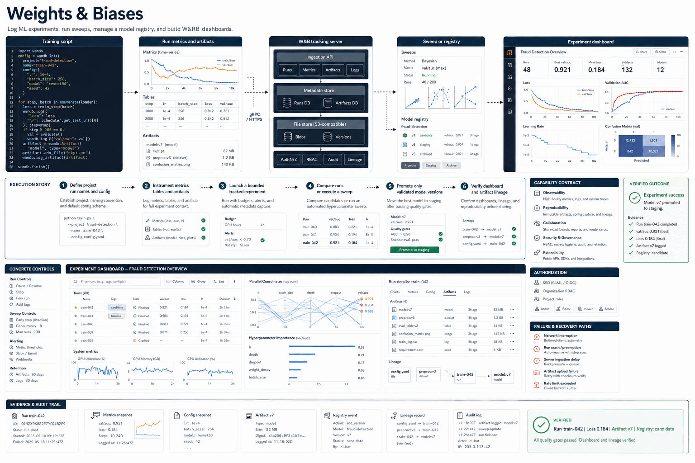

# Weights & Biases

> Log ML experiments, run sweeps, manage a model registry, and build W&B dashboards.

This repository packages one focused Hermes skill as a public, documentation-first capability. The blueprint below explains the actual operating surfaces, control points, failure paths, and evidence expected from a trustworthy run.

## The problem it solves

Tool integrations can create accidental side effects when authentication, scope, preview, execution, and verification are not separated.

## System components

- **Training script**
- **Run metrics and artifacts**
- **W&B tracking server**
- **Sweep or registry**
- **Experiment dashboard**

## Execution walkthrough

1. **Define project run names and config**
2. **Instrument metrics tables and artifacts**
3. **Launch a bounded tracked experiment**
4. **Compare runs or execute a sweep**
5. **Promote only validated model versions**
6. **Verify dashboard and artifact lineage**

## Example request

> In a disposable test workspace, log ML experiments, run sweeps, manage a model registry, and build W&B dashboards. Return the result, the evidence used to verify it, and any limitations or actions that still require approval.

## Evidence contract

- `request.json` — captures request.
- `inspection.json` — captures inspection.
- `preview.json` — captures preview.
- `execution.json` — captures execution.
- `verification.json` — captures verification.
- `receipt.json` — captures receipt.

A run is complete only when the final artifact can be reopened or re-read and compared with the requested acceptance criteria. An attempted command or successful API response alone is not sufficient proof.

## Safety boundaries

- Confirm the exact target, owner, environment, and authority before acting.
- Preview consequential changes and pause at the approval gate.
- Keep credentials, personal data, and private endpoints out of logs and examples.
- Preserve user work and avoid unrelated changes.
- Report verification failures as incomplete work.

Read [SAFETY.md](SAFETY.md), [SECURITY.md](SECURITY.md), and the detailed [How it works](docs/HOW-IT-WORKS.md) guide before connecting this workflow to a real service or production environment.

## Repository contents

| Path | Purpose |
| --- | --- |
| `SKILL.md` | Trigger conditions and concise agent workflow. |
| `assets/system-blueprint.png` | High-resolution technical architecture poster. |
| `docs/HOW-IT-WORKS.md` | Component and execution-stage details. |
| `docs/EXAMPLES.md` | Safe, review-only, and failure scenarios. |
| `docs/PRODUCT.md` | Audience, problem statement, and maturity. |
| `SAFETY.md` / `SECURITY.md` | Operational and disclosure boundaries. |
| `tests/README.md` | Contract and package validation guidance. |

## Maturity

This is a public reference workflow extracted from a larger private workbench. It does not include a hosted runtime, credentials, or private infrastructure. Adopters must connect compatible tools and validate behavior in their own environment.

## Contributing

Contributions should improve capability accuracy, safe defaults, reproducible examples, or verification evidence without broadening the skill beyond its stated purpose. See [CONTRIBUTING.md](CONTRIBUTING.md).
