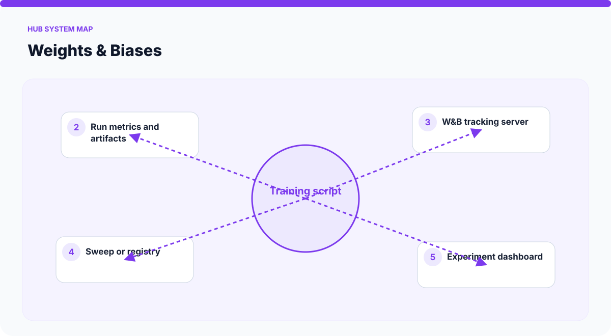
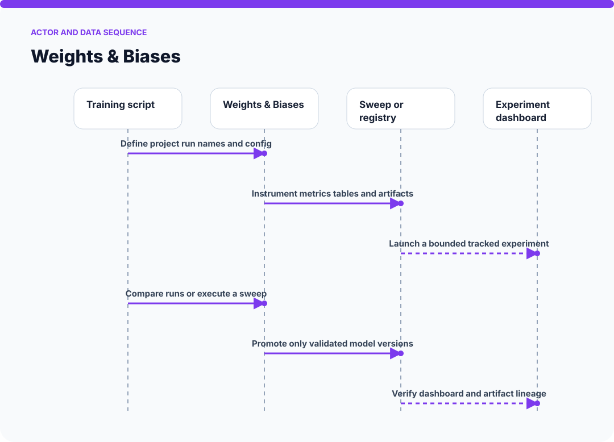
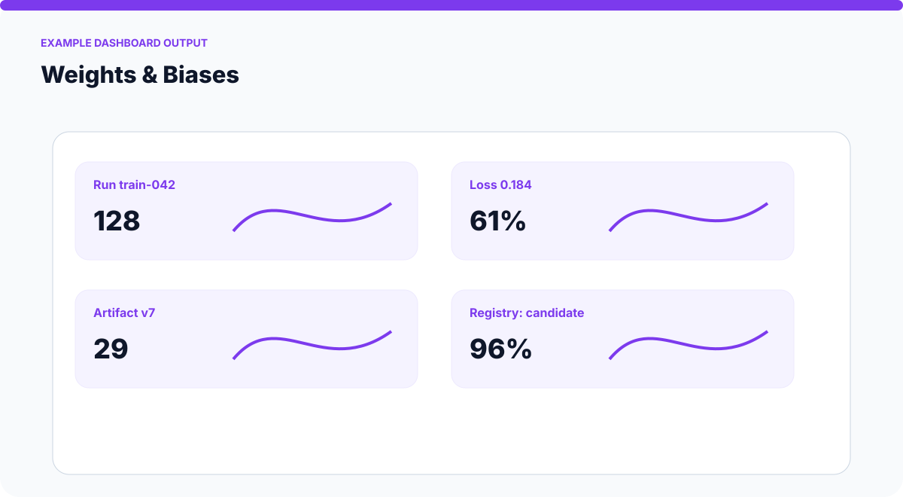
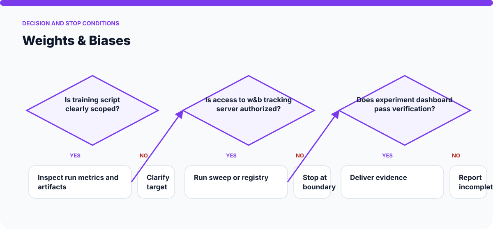

  

# Weights & Biases

> Log ML experiments, run sweeps, manage a model registry, and build W&B dashboards.

This repository packages a single, reusable Hermes skill as a documentation-first public reference. It explains the problem, operating contract, safety boundaries, expected evidence, and example usage without claiming a bundled runtime that is not present.

## Why this exists

Tool integrations can create accidental side effects when authentication, scope, preview, execution, and verification are not separated. **Weights & Biases** turns that work into an explicit sequence with visible inputs, outputs, review points, and completion evidence.

## Why the repository has this name

The shared `hermes-skill-` prefix identifies this as a portable Hermes workflow package. `weights-and-biases` names the capability directly—weights and biases—so the repository remains searchable and understandable outside the original AI-OS workspace. The public title is **Weights & Biases**.

## At a glance

| Question | Answer |
| --- | --- |
| What is it? | Tool and service workflow packaged as a reusable Hermes `SKILL.md`. |
| What does it do? | Log ML experiments, run sweeps, manage a model registry, and build W&B dashboards. |
| Who is it for? | Builders, operators, and reviewers who want a repeatable, inspectable workflow. |
| What is delivered? | A skill contract, examples, safety guidance, release checks, and rendered SVG diagrams. |
| Runtime status | Documentation-first reference package; connect it to the tools available in your own environment. |

## Visual system map

The diagram below is specific to this capability. It shows the real components and artifacts involved rather than a generic agent loop.

## Operation sequence

1. Define project run names and config
2. Instrument metrics tables and artifacts
3. Launch a bounded tracked experiment
4. Compare runs or execute a sweep
5. Promote only validated model versions
6. Verify dashboard and artifact lineage

See [How it works](docs/HOW-IT-WORKS.md) for the component-by-component walkthrough and evidence model.

## Example visual output

This is an explanatory mockup of the output shape—not fabricated proof that a live run occurred. The labels show the information a real result should expose for review.

## Decision and stop conditions

## Inputs

- The target tool, workspace, or local runtime
- A precisely scoped read or write request
- Existing authorized credentials supplied by the environment

## Outputs

- A preview or completed bounded operation
- A verification record of what changed
- Explicit blockers when authorization or state is ambiguous

## Example request

> In a disposable test workspace, log ML experiments, run sweeps, manage a model registry, and build W&B dashboards. Return the result, the evidence used to verify it, and any limitations or actions that still require approval.

More scenarios and expected results are in [Examples](docs/EXAMPLES.md).

## Safety and trust model

This workflow may create or change artifacts, so consequential actions require a preview and explicit authorization. It must stop when ownership, authorization, target state, or publication safety is ambiguous. Never place credentials, private endpoints, personal data, or environment-specific secrets in the skill package or its evidence.

Read [SAFETY.md](SAFETY.md) and [SECURITY.md](SECURITY.md) before connecting the workflow to real accounts, devices, repositories, or production data.

## What this repository does not claim

- It does not bypass authentication, silently broaden permissions, or perform unrelated account changes.
- It is not a hosted service, executable application, or vendor endorsement.
- It does not include credentials, private infrastructure, or the original personal AI-OS configuration.
- A successful example does not prove production readiness for every environment.

## Repository map

| Path | Purpose |
| --- | --- |
| `SKILL.md` | Concise trigger conditions and operating workflow used by an agent. |
| `docs/PRODUCT.md` | Problem framing, audience, boundaries, and readiness model. |
| `docs/HOW-IT-WORKS.md` | Expanded walkthrough with diagrams and verification points. |
| `docs/EXAMPLES.md` | Realistic safe, review-only, and stop-condition scenarios. |
| `docs/RELEASE.md` | Checks to complete before publishing a revision. |
| `assets/system-map.svg` | Capability-specific block, graph, stack, loop, or canvas architecture. |
| `assets/operation-sequence.svg` | Actor and data sequence using the skill’s real stages. |
| `assets/example-output.svg` | Illustrated mockup of the artifact or interface a run should produce. |
| `assets/decision-guide.svg` | Capability-specific decisions, approval boundaries, and stop states. |
| `tests/README.md` | Manual contract and package validation guidance. |
| `SAFETY.md` / `SECURITY.md` | Operational and disclosure boundaries. |

## Use this package

1. Read `SKILL.md` and confirm its trigger matches your task.
2. Copy the package into the skill location supported by your agent environment, or use it as a reference when authoring an equivalent workflow.
3. Replace tool assumptions with the tools actually available to you; do not add secrets to the repository.
4. Run the smallest safe example from `docs/EXAMPLES.md`.
5. Record verification evidence and review any consequential action before widening scope.

## Contributing

Improvements are welcome when they preserve narrow scope, honest capability claims, safe defaults, and reproducible verification. See [CONTRIBUTING.md](CONTRIBUTING.md).
